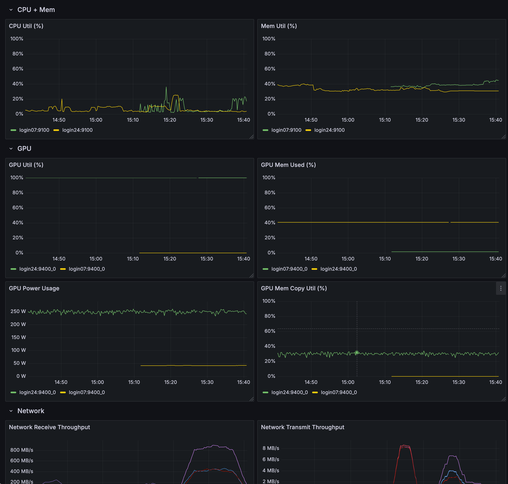

# NERSC Metrics Scripts

Simple bash scripts to deploy Prometheus, Grafana, node-exporter, and DCGM for monitoring Slurm job metrics at NERSC.

## Table of Contents

- [Introduction](#introduction)
- [Installation](#installation)
- [Usage](#usage)
- [Grafana Dashboard](#grafana-dashboard)

## Introduction

This repository contains a set of simple bash scripts designed to deploy Prometheus, Grafana, node-exporter, and DCGM for monitoring Slurm job metrics at the National Energy Research Scientific Computing Center (NERSC).

## Installation

1. Clone the repository to your local machine:

    ```bash
    git clone https://github.com/yourusername/nersc-metrics-scripts.git
    cd nersc-metrics-scripts
    ```

2. Download `node_exporter`:

    Follow the instructions on the [Prometheus Node Exporter Guide](https://prometheus.io/docs/guides/node-exporter/) to download and install `node_exporter`.

3. Update `NODE_EXPORTER_DIR` in `start_collectors.sh`:

    Edit the `start_collectors.sh` script and update the `NODE_EXPORTER_DIR` variable with the location of your `node_exporter` installation.

    ```bash
    NODE_EXPORTER_DIR=/path/to/node_exporter
    ```

## Usage

### Start Prometheus and Grafana

This script starts up Prometheus and Grafana, which can be accessed on NERSC JupyterHub if deployed there.

```bash
./start_grafana_prometheus.sh
```

After running the script, you can access Grafana by visiting:
```
https://jupyter.nersc.gov${JUPYTERHUB_SERVICE_PREFIX}proxy/3000/login
```
If you run this on a JupyterHub terminal, you will be directed to the Grafana login page. Make sure to change the default login credentials for security purposes.


### Start Collectors
This script starts up DCGM (in a Podman-HPC container) and Prometheus node exporter. Run this on any machine from which you want to collect metrics.

```bash
./start_collectors.sh
```

### Generate Prometheus Targets JSON
This Python script generates the Prometheus JSON file with targets. Run this with the list of hostnames where you ran `start_collectors.sh`.

```bash
./generate_prometheus_json.py [List of hostnames] --output prometheus_cfg/targets.json
```
Example:

```bash
./generate_prometheus_json.py nid0099 nid0231 nid1007 --output prometheus_cfg/targets.json
```

## Grafana Dashboard
A Grafana dashboard template is provided in the grafana_dashboard.json file. You can import this template into Grafana to visualize the collected metrics.

### Importing the Dashboard
1. Open Grafana in your web browser.
2. Go to the "Dashboards" section.
3. Click on "Import".
4. Upload the grafana_dashboard.json file.
5. Follow the prompts to complete the import.

### Dashboard Preview
Here’s a preview of the Grafana dashboard:


